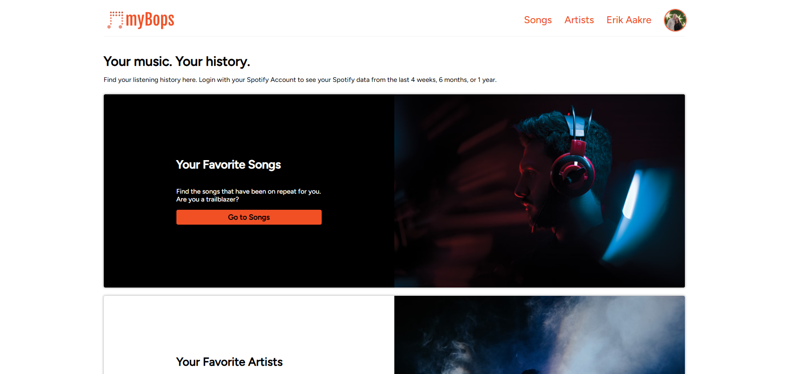
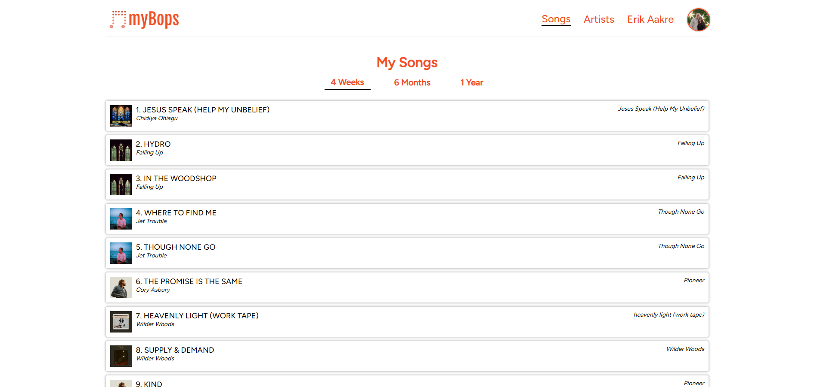
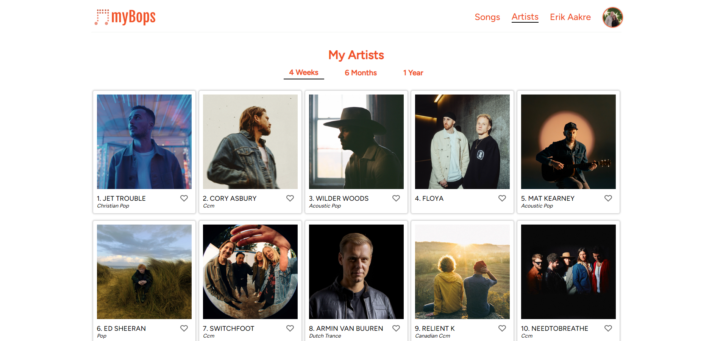

# Link to Back-End for this project

[Live Site](https://mybops.apps.dj/)
Must have a Spotify Account to login.

[myBops back-end](https://github.com/eaakre/mybops-backend/tree/stage-1.2)
use the stage-1.2 branch at this point.

## Description of the project

This project was based on the idea of "Spotify Wrapped" each December. Instead of waiting until December, myBops will show you your top songs and artists using your listening history from the last 4 weeks, 6 months, or 12 months. This will eventually be hosted online, but at this point, users must use the stage-1.2 branch of the myBops backend for the API to work.

## Technologies used

This project uses React.js as well as HTML and CSS to bring you your Spotify Data.

## Screenshots

